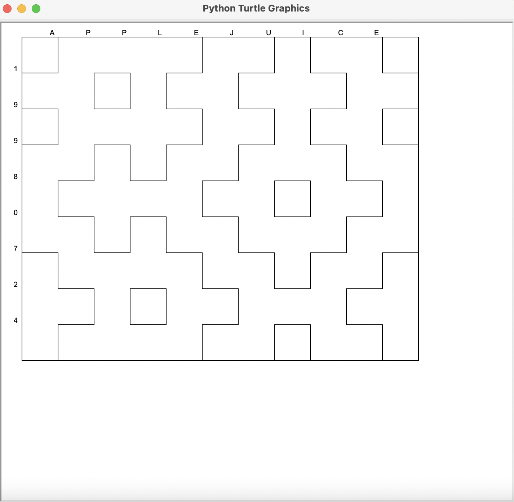
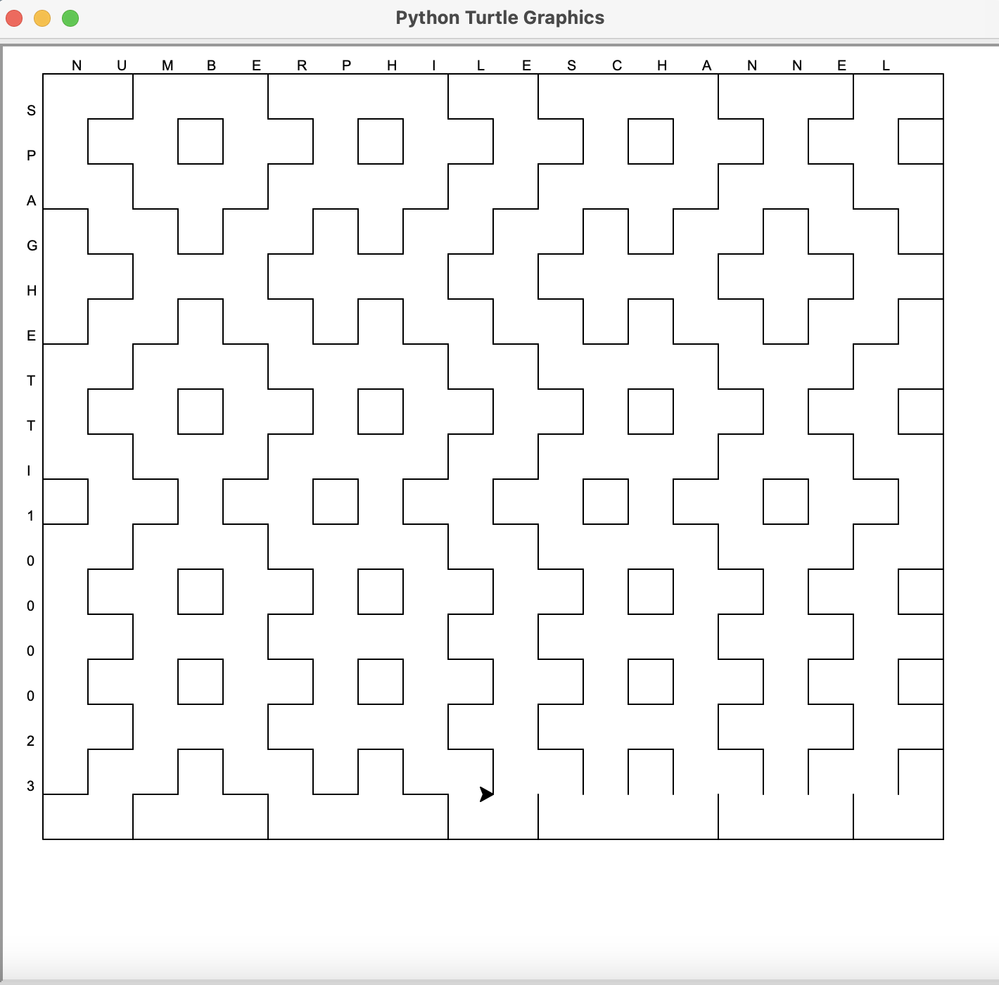

# Hitomezashi-Stitch-Patterns

## About project ##
This tiny app has been created after I got inspired by [this Numberphile's video](https://www.youtube.com/watch?v=JbfhzlMk2eY). 
To build it I used Turtle-python module.

## How does it work? ##
Firstly, user have to input two strings which will be converted in a way to contain only digits and/or alphabetical characters.
Then, from each converted string program will build binnary list using this rules:

* every vowel and odd digit in string - 1 in binnary list
* every consonant and even digit in string - 0 in binnary list

Now, from two adjacent sides of rectangle will be drawn dashed lines, every specific K-th (counting from upper left corner of rectangle)
line will start with 'dash-part' if binnary_array[K] is equal 1, else K-th line starts with 'blank-part'. 

  
  

## Running Code ##
Just download these two python files and type in terminal **_python3 main.py_** 
!! Make sure you are using Python 3.8.x Interpreter!! 
From unknown reasons turtle module doesn't work properly with Python 3.9 and 3.10, at this moment (27.07.2022).

